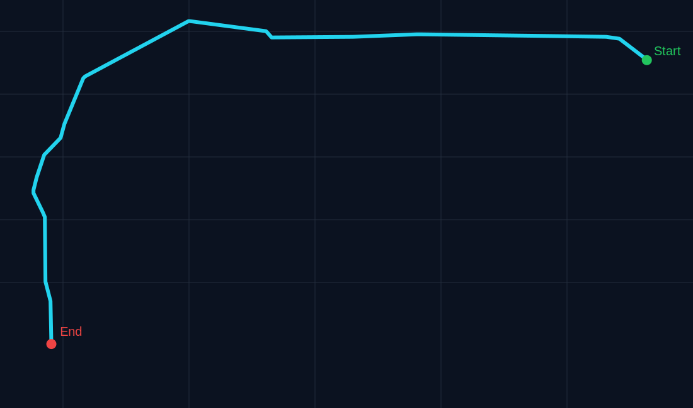
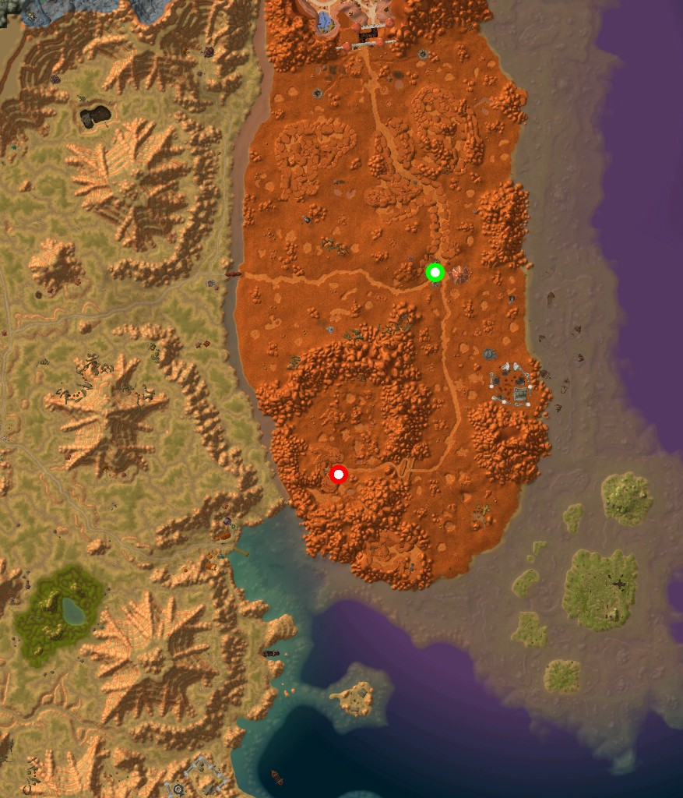

# WoW Auto Pathfinder

WoW Auto Pathfinder is an end-to-end route planning project that builds navigation geometry from exported map assets, generates a NavMesh, and outputs a walkable route with 2D visualization.

## Pipeline

- Export ADT OBJ and placement CSV files
- Merge terrain + WMO + M2 into route geometry
- Build NavMesh (tiled/solo strategy)
- Solve route and export `route.json`
- Render 2D route preview

## Key Docs

- `docs/PROJECT-IMPLEMENTATION-OVERVIEW.md`
- `docs/RELEASE-GUIDE.md`
- `docs/GITHUB-PUBLISH-CHECKLIST.md`

## Route 2D Preview

The image below shows the current route output preview:

### PNG Snapshots

Route result snapshot:

Start/end marker snapshot:

